## Application Delivery & DevOps practices with Azure Service Fabric

Quick guidance how to create Build & Release with VSTS & Secure Azure Service Fabric. This is done via 2 following steps: 

- **Create Continuous Integration definition with Visual Studio Team Service** 
- **Create new Release definition with Visual Studio Team Service**
- **Deploy/update) the app & enjoy DevOps with Azure Service Fabric**

> **Note:** In this example I'll focus on WordCount application building & releasing to Azure Service Fabric. It will offer you foundation/elementary how to do CI/CD/RM. Application code you can pic up from [my repo]() or from original source at GitHub also - link [WordCount](https://github.com/Azure-Samples/service-fabric-dotnet-getting-started/tree/master/Services/WordCount)

###Create Continuous Integration definition with Visual Studio Team Service

> **Note:** Since this is an basic/usual step I'll just provide few links to get you going and focus on Azure Service Fabric specifics 
> 
*To create typical Continuous Integration Build, please follow this* [*guide*](https://www.visualstudio.com/en-us/docs/build/get-started/dot-net)
>
>I'm having 2 branches, Dev & Master, for this example. It is doable just with master branch - your choice how you will it ;)

your end result should look like this:

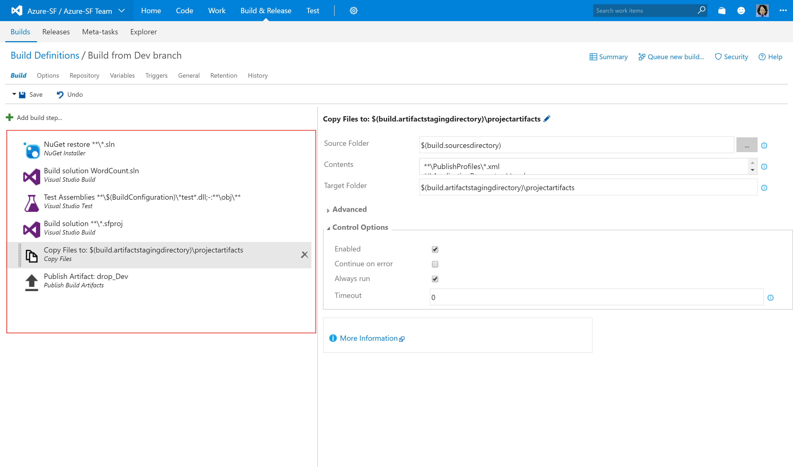

Once you have created Build, lets now focus on step that will enable us to have version control over application **fabric:/WordCount** and it's 2 microservices. To enable version control and keep track of the changes we will add **Update Service Fabric App Version** step, from **Utility**, to our build pipeline. 

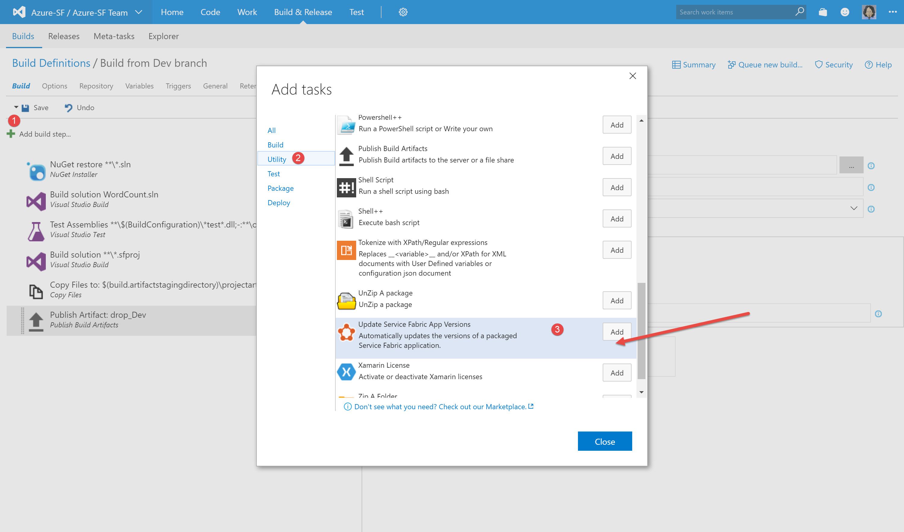

Now that we have **Update Service Fabric App Version** step, it needs to be configured.

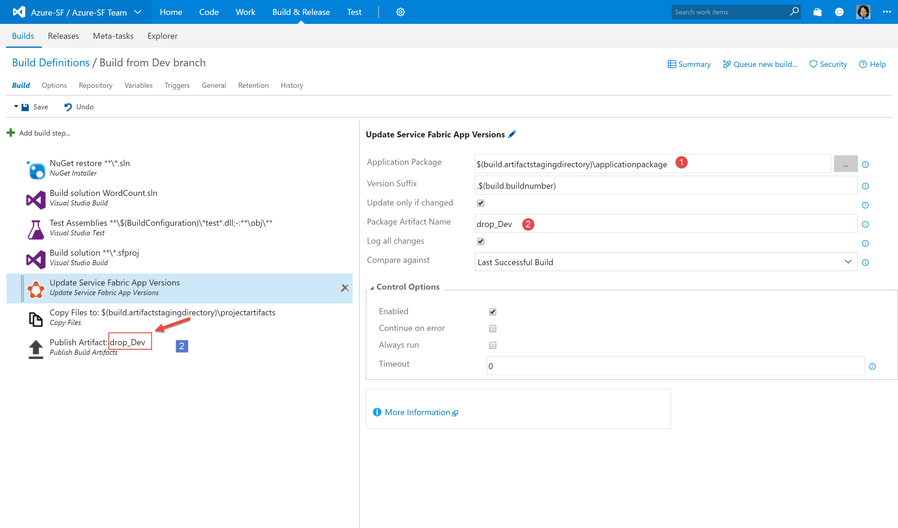 

> **Note:** Please have in mind where regards to name of your "Publish Artifact" step and application package 

Save changes to your Build definition & Queue your build! enjoy & feel success! :)

Success should look something like this :)

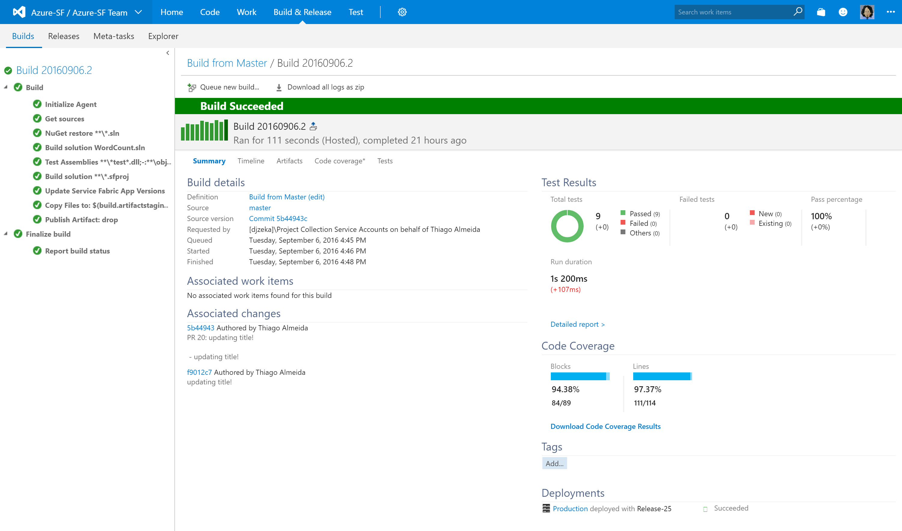 

#### *Updating/Changing Cloud publishing profile*
Please havi in mind Azure Service Fabric capabilities regarding publishing profiles. Publishing profiles are used for Upgrade settings, Path to an application parameter file, Service Fabric cluster connection parameters and etc.

Good starting point can be [Publish an application to a remote cluster by using Visual Studio](https://azure.microsoft.com/en-us/documentation/articles/service-fabric-publish-app-remote-cluster/) and [Configure secure connections to a Service Fabric cluster from Visual Studio](https://azure.microsoft.com/en-us/documentation/articles/service-fabric-visualstudio-configure-secure-connections/)

I'll share snippet from my of Cloud.xml profile:

      <ClusterConnectionParameters ConnectionEndpoint="<clustername>.westeurope.cloudapp.azure.com:19000" 
       X509Credential="true" ServerCertThumbprint="2148DxxxxxxxxxxxxxxxxF4ADBA" 
       FindType="FindByThumbprint" 
       FindValue="2148D616E820xxxxxxxxxxxxxxxxxxx86EF4ADBA" 
       StoreLocation="CurrentUser" 
       StoreName="My" />
      <ApplicationParameterFile Path="..\ApplicationParameters\Cloud.xml" />
      <UpgradeDeployment Mode="UnmonitoredAuto" Enabled="true">
    <Parameters Force="True" ForceRestart="True" />
      </UpgradeDeployment>
    </PublishProfile>

###Create new Release definition with Visual Studio Team Service

If you are having "joy & success" with Build it is now time to create Release and complete our pipeline with VSTS.

Please under your project navigate to **Release**, click on create new Release Definition and choose Azure Service Fabric Deployment

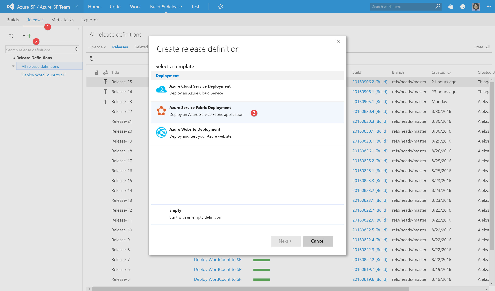 

	
Next select your Source(Build Definition), enable continuous deployment and click create

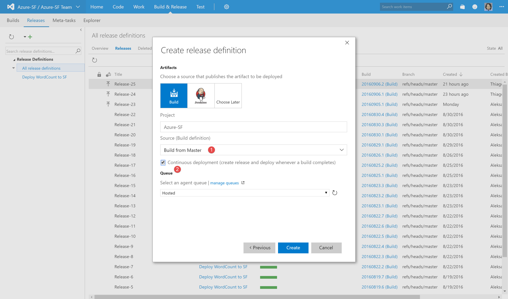 

After sucesful creation of new release definition, first we shall configure **Artifacts** for the new release

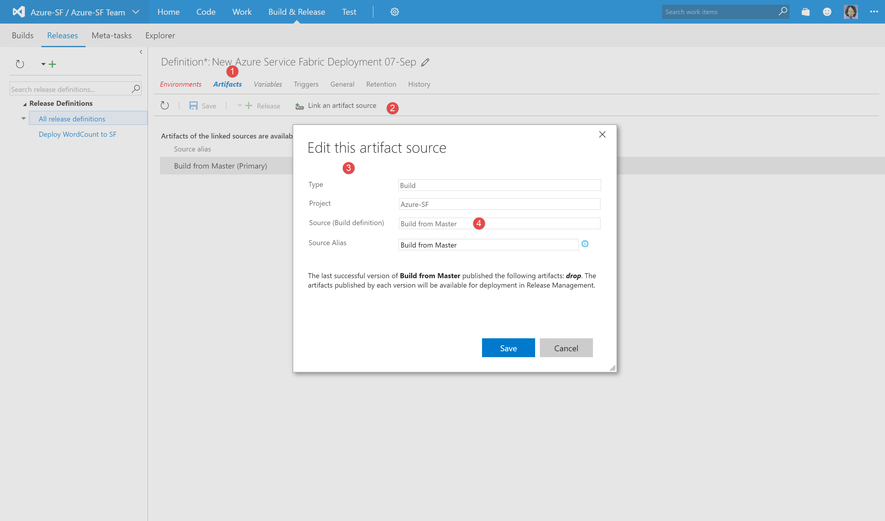 

> **Note:** this is where release definition will "look" for the artifact to do continuous deployment 

Once this is done we need to jump to the environment tab, under current release definition, to configure Publish profile, App package and Cluster connection 

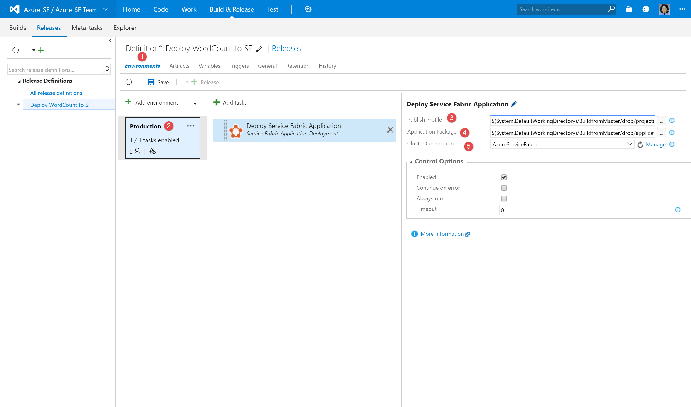 
 
> **Note:** first choose proper publish profile - usually **cloud.xml**

**Congrats, now you have configured release definition! You can test it by manually creating new release** 

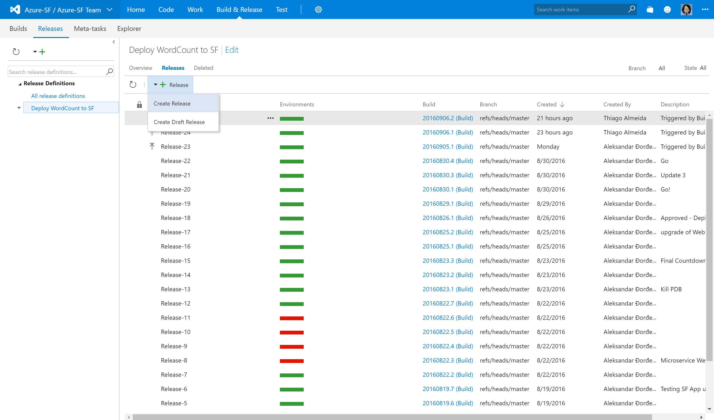 

It should look like something this:

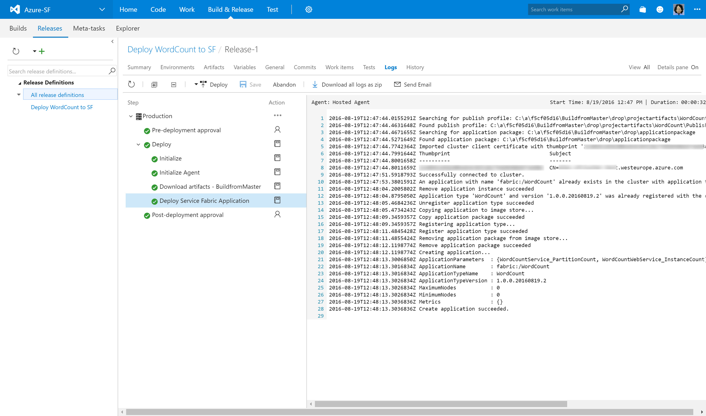 

Congrats! You have successfully deployed first version of your WordCount app! :)

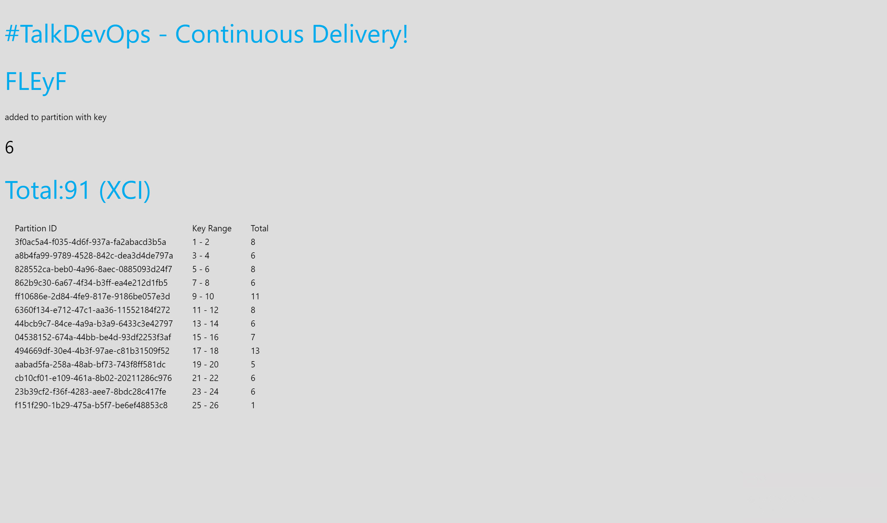 

###Deploy/update the app & enjoy DevOps with Azure Service Fabric

> **Note:** At this moment you should have your app & let's do some updates to it :) **

Let's do some some changes to the WordCount app and roll-forward updates to it.
The easiest way is to go to the fabric:/WordCount/WordCountWebService microservice and make changes to the **index.htlm**

 > **Note:** Index.htlm you can find under WordCount solution -> WordCount.WebService -> wwwroot

lets add small greetings message under the <body> section; e.g.:
    
    <body>
    <h1>#TalkDevOps - Continuous Delivery!</h1> 

Now first CI will kick-in and build the application, and while doing it it will detect changes to the **index.htlm** and reflect that in the build step **Update Service Fabric App Versions**

result of **Update Service Fabric App Versions** should look like this:

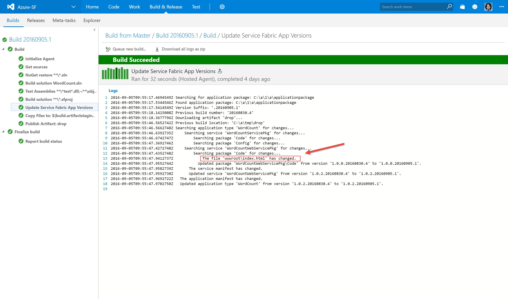

After the successful build Continuous Delivery will kick-in. It should look like this:

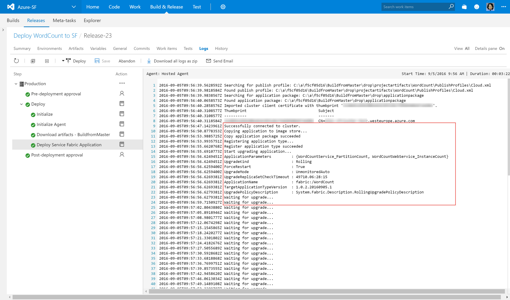 

...**and there you go! Congrats - you are now delivering CI/CD/RM DevOps practices with secure Azure Service Fabric!** 

> **Note:** You can go now to the Service Fabric explorer and/or to the the app to check out more details
> 

#Let's #TalkDevOps

  
