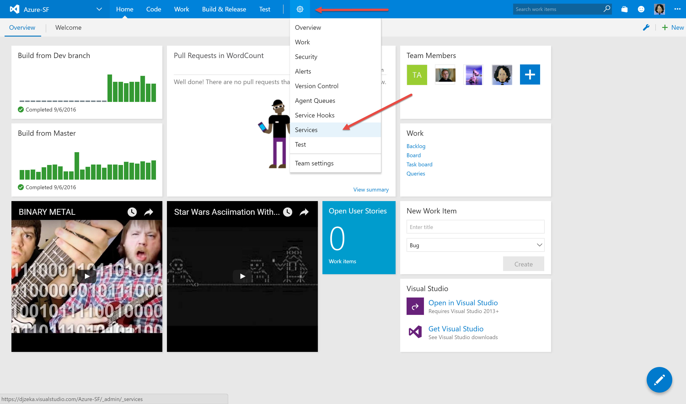
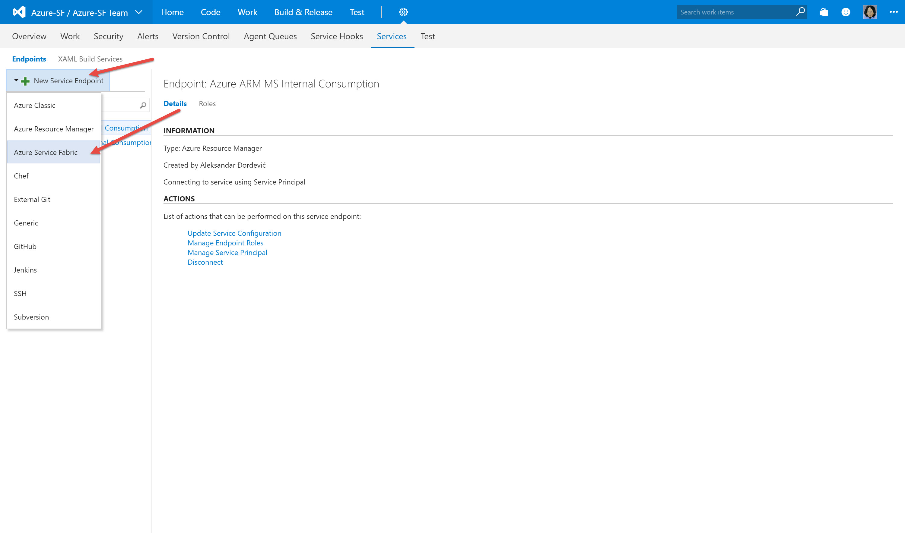
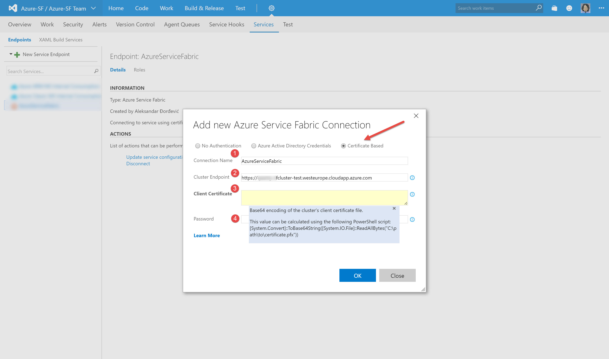
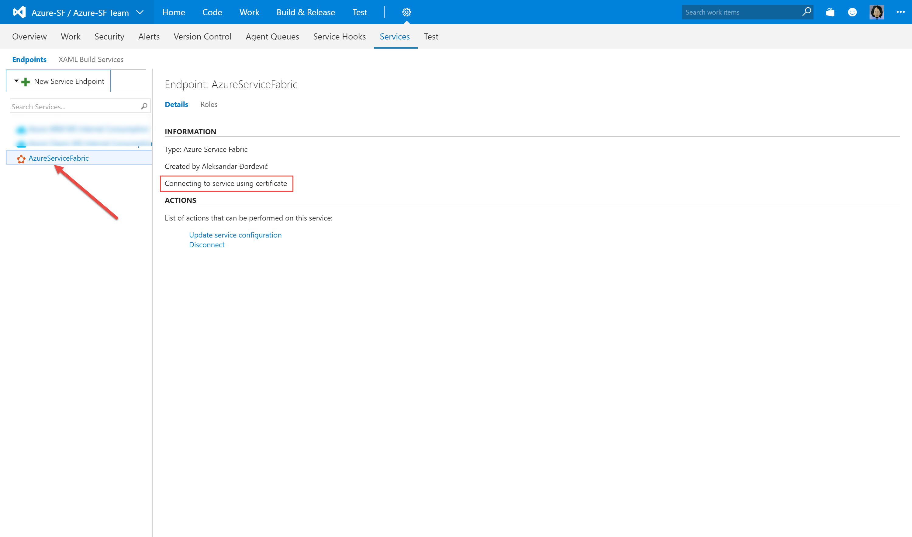

## Connecting VSTS & Azure Service Fabric

Quick guidance how to connect VSTS & Secure Azure Service Fabric. This is done via 2 following steps: 

- **Create new project at Visual Studio Team Services & import source code/example app** 
- **Create a Service Link from Visual Studio Team Services to an Azure Service Fabric**

### Create new project at Visual Studio Team Services & import source code/example app
> **Note:** Since this is an basic/usual step I'll just provide few links to get you going

Create new project at Visual Studio Team Services & import source code/example app - [steps/example](https://github.com/Microsoft/PartsUnlimited/tree/master/docs/HOL-Continuous_Integration#hol---parts-unlimited-website-continuous-integration-with-visual-studio-team-services) 

### Create Azure Key Vault & Import certificate to Azure Key Vault

After creation of new team project at VSTS, with previous step, proceed to settings and pick services

then click on New Service Endpoint and choose **Azure Service Fabric**

Then select **Certificate based** authentication and fill in the fields:

> **Note:** at the point 3 you'll need to have Base64 encoding of the cluster certificate. As you can see you have help at the page or alternatively grab a one of mine [scripts]()

After this last step you have connected VSTS & your Azure Service Fabric cluster. It should look like this:

> **Note:** Now it is time to create CI/CD/RM with VSTS & Azure Service Fabric cluster :)

 

