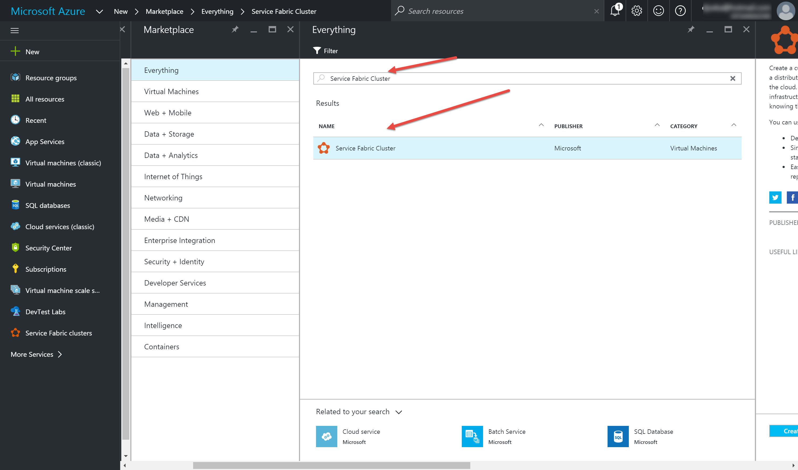
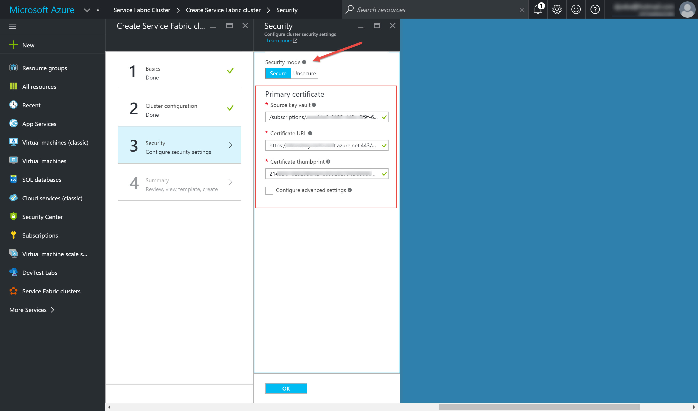
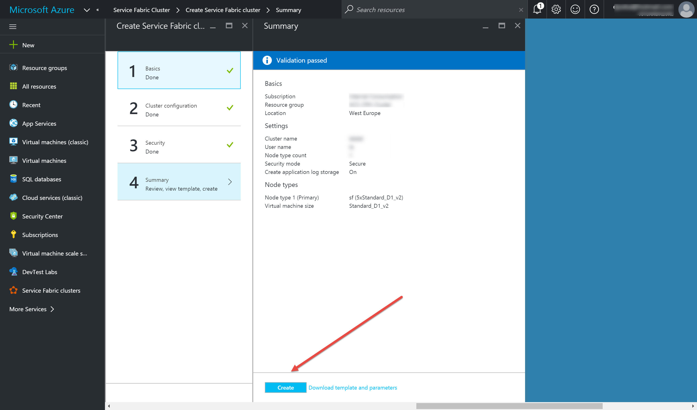

## Creating secure Azure Service Fabric Cluster

Quick guidance how to create Secure Azure Service Fabric. This is done via 3 following steps: 

- **Create SelfSign Certificate using PowerShell** 
- **Create Azure Key Vault & Import certificate to Azure Key Vault**
- **Create new secure Azure Service Fabric (ARM template or Azure portal)**

### Create Self-Signed Certificate using PowerShell 
> **Note:** Since this is an example we will use selfsigned certificate. For production environments this is highly NOT recommended. Also, it would be good to check if the FQDN is available prior creating certificate ;)

To create self-signed with power shell you can use following code

    $DnsName = 'abc.com'
    $password = '<your_pwd>'
    $securePassword = ConvertTo-SecureString -String $password -AsPlainText -Force
    
    New-SelfSignedCertificate -CertStoreLocation Cert:\CurrentUser\My -DnsName $DnsName -Provider 'Microsoft Enhanced Cryptographic Provider v1.0'

>**Note**:more details you can find here [New-SelfSignedCertificate cmdlet](https://technet.microsoft.com/en-us/library/hh848633.aspx)

### Create Azure Key Vault & Import certificate to Azure Key Vault

To create new Azure Key Vault use following code or jump to [scripts]() folder and pick up mine script

    $Location = 'West Europe'
    $ResourceGroupName = 'KeyVaultKeyVaultKeyVault'
    $VaultName = 'KeyVaultKeyVaultKeyVault'
    
    #Adding ARM Account
    Login-AzureRmAccount
    
    #Creating new ResourceGroup for Azure Key Vault
    
    New-AzureRmResourceGroup –Name $ResourceGroupName -Location $Location
    
    #Creating new Azure Key Vault
    
    New-AzureRmKeyVault -VaultName $VaultName -ResourceGroupName $ResourceGroupName -Location $Location -Verbose
 
>**Note**: more details you can find at [Get started with Azure Key Vault](https://azure.microsoft.com/en-us/documentation/articles/key-vault-get-started/) 

**Importing certificate to Azure Key Vault**

Azure resource provider cant "deal" with pfx certificate stored in Azure Key Vault, instead it uses special JSON format that includes the .pfx as a base-64 encoded string and the private key password. 

To make process easier there is a [Azure Service Fabric Helper PowerShell module](https://github.com/ChackDan/Service-Fabric#microsoft-azure-service-fabric-helper-powershell-module) available at GitHub that will help you execute this process.

>**Note**: if you are interested more in this step and have eagerness to get details, pls. check this blog [pfx-certificate-in-azure-key-vault](http://www.rahulpnath.com/blog/pfx-certificate-in-azure-key-vault/)  

First download repo & install module

    Import-Module "C:\temp\ServiceFabricRPHelpers\ServiceFabricRPHelpers.psm1"

next, you will invoke command to upload cert, in json format.

    Invoke-AddCertToKeyVault -SubscriptionId <guid> -ResourceGroupName asf-keyvault -Location "West US" -VaultName asfvault -CertificateName mycert -Password "<password>" -UseExistingCertificate -ExistingPfxFilePath "C:\path\to\mycertkey.pfx" 

as an output of executing this command you will get few needed information for the cluster creation. Output should look like this:

    Name  : CertificateThumbprint
    Value : <value>
    
    Name  : SourceVault
    Value : /subscriptions/<guid>/resourceGroups/asf-keyvault/providers/Microsoft.KeyVault/vaults/asfvault
    
    Name  : CertificateURL
    Value : https://myvault.vault.azure.net:443/secrets/mycert/4d087088df974e869f1c0978cb100e47

>**Note**: [Azure Service Fabric Helper PowerShell module](https://github.com/ChackDan/Service-Fabric#microsoft-azure-service-fabric-helper-powershell-module) also can help you with sharting from scratch - Create and upload a certificate to azure Key Vault. ;)
>

now it is time to create Secure Azure Service Fabric Cluster...

###Create new secure Azure Service Fabric (ARM template or Azure portal)

Now you have all prerequisites to proceed and create **secure Azure Service Fabric**

####Deploying **secure Azure Service Fabric** via Azure Portal
Go to Azure portal, click on new and search for Azure Service Fabric

fill needed Service Fabric Basic & Cluster configuration, once at step 3 "Security" fill out **Source key vault**, **Certificate URL** and **Certificate thumbprint** 

Click OK, go to step 4, review & start deployment of Azure Service Fabric cluster

After few minutes you'll have your **Azure Service Fabric** deployed

####Deploying **secure Azure Service Fabric** via ARM template 

There are multiple way how to use ARM template and to deploy/create Azure Service Fabric(VS, VSTS, PS and etc.) so here you'll get needed building blocks, and rest is up to you.

Good starting point is [azure-quickstart-templates](https://github.com/Azure/azure-quickstart-templates) and finding [service-fabric-secure-cluster-5-node-1-nodetype-wad](https://github.com/Azure/azure-quickstart-templates/tree/master/service-fabric-secure-cluster-5-node-1-nodetype-wad). There you will find starting ARM template and parameter files for your IaC or you can grab mine ARM template & param files.

**Important** and interesting part is at ARM parameters file where we are pointing to the Key Vault and needed secrets for deployment of secure Azure Service Fabric.

here is a snippet of the param file:

    "sourceVaultvalue": {
      "value": "/subscriptions//resourceGroups/<Resource group name>/providers/Microsoft.KeyVault/vaults/<vault name>"
    },
    "certificateUrlvalue": {
      "value": "https://<name of the vault>.vault.azure.net:443/secrets/<exact location>"
    },
    "clusterProtectionLevel": {
      "value": "EncryptAndSign"
    },  

Now is up to *You* to choose how to use, tweak & deploy secure Azure Service Fabric cluster using ARM templates

>**Note**: Good starting points can be [Deploy resources with Resource Manager templates and Azure PowerShell](https://azure.microsoft.com/en-us/documentation/articles/resource-group-template-deploy/) ; [Creating and deploying Azure resource groups through Visual Studio](https://azure.microsoft.com/en-us/documentation/articles/vs-azure-tools-resource-groups-deployment-projects-create-deploy/) 

  

 

